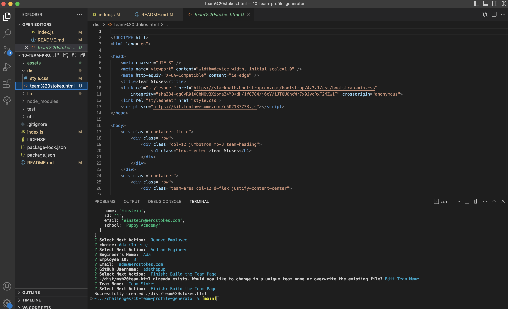
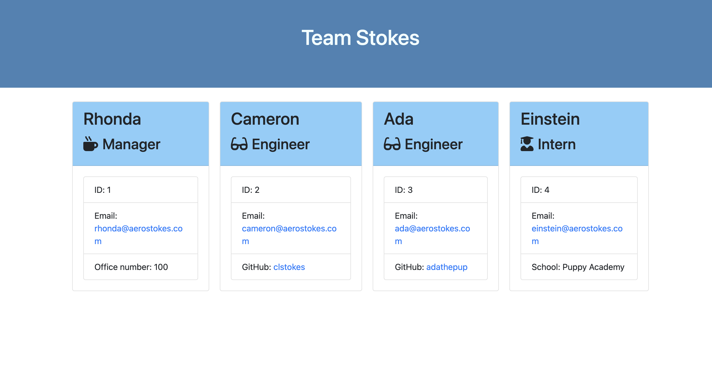

# 10: Team Profile Generator     

## Description

A node.js application to generate a team profile webpage from the command line based on user responses to inquirer prompts.  

  

Sample Team Profile Webpage:  

## Table of Contents

- [Installation](#installation)
- [Usage](#usage)
- [License](#license)
- [Tests](#tests)
- [Credits](#credits)
- [How to Contribute](#how-to-contribute)
- [Questions](#questions)

## Installation
NOTE: Requires [Node.js](https://nodejs.org/en)
1. Clone the repo to your local machine.
2. With the cloned location as the active directory, install the npm dependencies from terminal with the command `npm i`.  

## Usage

With the cloned location as the active directory, run the application from terminal with the command `node index.js`.  
Follow the prompts in the terminal to add, edit, and preview your detailed team roster. When your roster is complete, select "Finish: Build the Team Page".
The application will create the webpage in the local '/dist' folder named '[teamname].html'. If a file already exists, you will be prompted whether to edit the team name to create a unique filename or overwrite the existing file.  

See [Walk-Thru Video](https://drive.google.com/file/d/1BIvn754k3-tKxHNdMhbxKu0MKYhbSj7k/view) for a detailed walk-thru of creating a sample team webpage using VS Code's Integrated Terminal.

## License

This project is covered under the following license: MIT License  
Refer to LICENSE in the repo for additional details.

## Tests

N/A

## Credits

N/A

## How to Contribute

[Contributor Covenant](https://www.contributor-covenant.org/)

## Questions

For questions or suggestions, contact:  
GitHub: [@aerostokes](https://github.com/aerostokes)  
Email: [rhonda@aerostokes.com](mailto:rhonda@aerostokes.com)